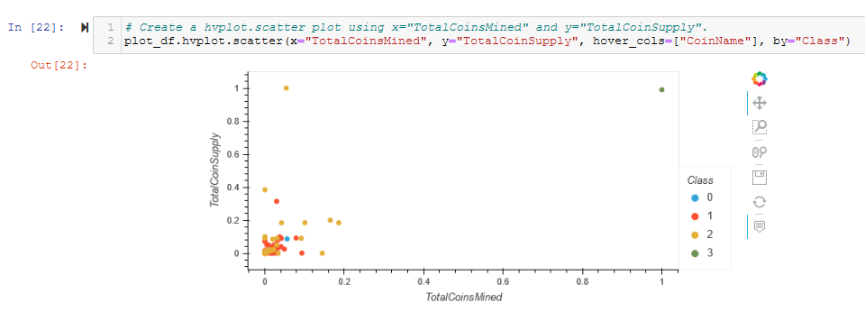

# Cryptocurrencies

## Overview

Our client was interested in offering a new cryptocurrency investment portfolio for its customers. The company, however, is lost in the vast universe of cryptocurrencies. So, they’ve asked us to create a report that includes what cryptocurrencies are on the trading market and how they could be grouped to create a classification system for this new investment. We decided to use unsupervised learning. We decided on a clustering algorithm to group the data, and data visualizations to share our findings with the board.

###### Technologies Used:

- Jupyter Notebook
- CryptoCompare comparison data (crypto_data.csv)
- Pandas Library
- Scikit-learn Library
- Plotly and Plotly-Express Libraries
- hvPlot Library

## Results

Detailed screenshots of every step in the flow for all four of this project's deliverables are in the **Appendix** below.

#### Deliverable 1 - Preprocessing the Data for PCA

Using our knowledge of Pandas, we preprocessed the dataset in order to perform PCA.

Steps:

1. Load the crypto_data.csv dataset. See Figure A1.
2. Keep all the cryptocurrencies that are being traded. See Figure A2.
3. Keep all the cryptocurrencies that have a working algorithm.
  - The definition of 'working algorithm' was not explained, but the shape of the dataframe in the starter code remained the same (i.e. 1144 rows x 6 columns), so it must be assumed that all the cryptocurrencies in Figure A2 had 'working' algorithms.
4. Remove the "IsTrading" column. See Figure A3.
5. Remove rows that have at least 1 null value. See Figure A4.
6. Keep the rows where coins are mined. See Figure A5.
7. Create a new DataFrame that holds only the cryptocurrencies names. See Figure A6.
8. Drop the 'CoinName' column since it's not going to be used on the clustering algorithm. See Figure A7.
9. Use get_dummies() to create variables for text features. See Figure A8.
10. Standardize the data with StandardScaler(). See Figure A9.

The crypto_df dataframe, which is the result of preprocessing of the crypto_data.csv file, is shown in Figure 1 (and A7), and is the checkpoint for Deliverable 1.

Figure 1 - The crypto_df dataframe after all preprocessing but before encoding and scaling

#### Deliverable 2 - Reducing Data Dimensions Using PCA

Using our knowledge of how to apply the Principal Component Analysis (PCA) algorithm, we reduced the dimensions of the X DataFrame to three principal components and placed these dimensions in a new DataFrame called pcs_df.

Steps:

11. Using PCA to reduce dimension to three principal components. See Figure A10.
12. Create a DataFrame with the three principal components. See Figure A11.

The pcs_df, which is the result of Principal component Analysis, is shown in Figure 2 (and A11), and is the checkpoint for Deliverable 2.

Figure 2 - The result of Principal Component Analysis (PCA) - pcs_df - showing the 3 principal components

#### Deliverable 3 - Clustering Cryptocurrencies Using K-means

Using our knowledge of the K-means algorithm, we created an elbow curve using hvPlot to find the best value for K from the pcs_df DataFrame created in Deliverable 2. Then, you’ll run the K-means algorithm to predict the K clusters for the cryptocurrencies’ data.

Steps:

13. Create an elbow curve to find the best value for K. See Figure A12.
14. Initialize the K-Means model, Fit the model, predict clusters. See Figure A13.
15. Create a new DataFrame including predicted clusters and cryptocurrencies features. See Figure A14.

The clustered_df, which is the result of clustering using K-means, is shown in Figure 3 (and A14), and is the checkpoint for Deliverable 3.

Figure 3 - The clustered_df with the new Class (i.e. Cluster) column from KMeans and Principal Components from PCA

#### Deliverable 4 - Visualizing Cryptocurrencies Results

Using our knowledge of creating scatter plots with Plotly Express and hvplot, we created visualized the distinct groups that correspond to the three principal components we created in Deliverable 3, then we created a table with all the currently tradable cryptocurrencies using the hvplot.table() function.

Steps:

16. Creating a 3D-Scatter with the PCA data and the clusters. See Figure A15.
17. Create a table with tradable cryptocurrencies. See Figure A16.
18. Print the total number of tradable cryptocurrencies (**the answer is 532**). See Figure A17.
19. Scaling data to create the scatter plot with tradable cryptocurrencies. See Figure A18.
20. Create a new DataFrame that has the scaled data with the clustered_df DataFrame index. See Figure A19.
21. Create a hvplot.scatter plot using x="TotalCoinsMined" and y="TotalCoinSupply". See Figure A20.

The hvplot table of clustered_df is shown in Figure 4 (and A16), and is the first checkpoint for Deliverable 4.

Figure 4 - Use hvPlot to create a sortable table from clustered_df

The hvplot 2D scatter plot of plot_df is shown in Figure 5 (and A20), and is the second checkpoint for Deliverable 4.

Figure 5 - Use hvPlot to create a 2D scatter plot of plot_df

## Summary

This project covered Unsupervised Learning and Visualization of various results. We read a CSV file and did some preprocessing on it. Then we reduced the dimensions using PCA. Then we used K-Means to cluster the data. Finally, we used several methods to visualize the results. Overall, it was a very interesting and useful project. It could have been better if 'working algorithm' for cryptocurrencies was defined.

## Appendix

In order to avoid cluttering the main body of this report, all figures and code are presented in this Appendix. Some may be duplicated in the main body of the report to illustrate major points.

###### Deliverable 1

Figure A1 - Read the crypto_data.csv file into crypto_df

Figure A2 - The shape of crypto_df is 1144 rows x 6 columns

Figure A3 - Drop the 'IsTrading' column from crypto_df

Figure A4 - Drop all rows with NaN or Null values

Figure A5 - Only keep rows where 'TotalCoinsMined' is > 0

Figure A6 - Create names_df with only the CoinName column for later use

Figure A7 - Drop Coinnames column from crypto_df

Figure A8 - Use the get_dummies() function to encode Algorithm and ProofType columns

Figure A9 - Use StandardScaler() to scale all columns by removing the mean and scaling to unit variance

###### Deliverable 2

Figure A10 - Instantiate PCA and fit / transform our data

Figure A11 - The resulting pcs_df DataFrame

###### Deliverable 3

Figure A12 - The elbow curve shows a a good choice at k=4

Figure A13 - Instantiate a KMeans() model and fit / predict with pcs_df

Figure A14 - Create clustered_df

###### Deliverable 4

Figure A15 - Use Plotly Express to create a 3D scatter plot of clustered_df

Figure A16 - Use hvPlot to create a sortable table from clustered_df

Figure A17 - Answer the question "What's the total number of tradable cryptocurrencies in clustered_df"?

Figure A18 - Use MinMaxScaler() to scale TotalCoinSupply and TotalCoinsMined

Figure A19 - Create plot_df

Figure A20 - Use hvPlot to create a 2D scatter plot of plot_df

