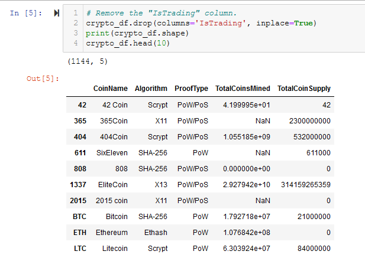

# Cryptocurrencies

## Overview

Our client was interested in offering a new cryptocurrency investment portfolio for its customers. The company, however, is lost in the vast universe of cryptocurrencies. So, they’ve asked us to create a report that includes what cryptocurrencies are on the trading market and how they could be grouped to create a classification system for this new investment. We decided to use unsupervised learning. We decided on a clustering algorithm to group the data, and data visualizations to share our findings with the board.

###### Technologies Used:

- Jupyter Notebook
- CryptoCompare comparison data (crypto_data.csv)
- Pandas Library
- Scikit-learn Library
- Plotly and Plotly-Express Libraries
- hvPlot Library

## Results

#### Deliverable 1 - Preprocessing the Data for PCA

Using our knowledge of Pandas, we preprocessed the dataset in order to perform PCA in Deliverable 2.

Please see Figures A1 - A9 in the Appendix for complete details of Deliverable 1. The crypto_df dataframe is shown in Figure 1 below, which is a duplicate of Figure A7.

Figure 1 - The crypto_df dataframe after all preprocessing but before encoding and scaling

#### Deliverable 2 - Reducing Data Dimensions Using PCA

Using our knowledge of how to apply the Principal Component Analysis (PCA) algorithm, we reduced the dimensions of the X DataFrame to three principal components and placed these dimensions in a new DataFrame called pcs_df.

Figure 2 - The result of Principal Component Analysis (PCA) - pcs_df - showing the 3 principal components

#### Deliverable 3 - Clustering Cryptocurrencies Using K-means

Using our knowledge of the K-means algorithm, we created an elbow curve using hvPlot to find the best value for K from the pcs_df DataFrame created in Deliverable 2. Then, you’ll run the K-means algorithm to predict the K clusters for the cryptocurrencies’ data.

Figure 3 - The elbow curve shows a a good choice for KMeans analysis is k=4, where the curve flattens substantially

Figure 4 - The clustered_df with the new Class (i.e. Cluster) column from KMeans and Principal Components from PCA

#### Deliverable 4 - Visualizing Cryptocurrencies Results

Using our knowledge of creating scatter plots with Plotly Express and hvplot, we created visualized the distinct groups that correspond to the three principal components we created in Deliverable 3, then we created a table with all the currently tradable cryptocurrencies using the hvplot.table() function.

Figure 5 - Use Plotly Express to create a 3D scatter plot of clustered_df

Figure 6 - Use hvPlot to create a sortable table from clustered_df

Figure 7 - Answer the question "What's the total number of tradable cryptocurrencies in clustered_df"?

Figure 8 - Use hvPlot to create a 2D scatter plot of plot_df

## Summary

## Appendix

In order to avoid cluttering the main body of this report, all figures and code are presented in this Appendix. Some may be duplicated in the main body of the report to illustrate major points.

Figure A1 - Read the crypto_data.csv file into crypto_df

Figure A2 - The shape of crypto_df is 1144 rows x 6 columns

Figure A3 - Drop the 'IsTrading' column from crypto_df

Figure 5 - Drop all rows with NaN or Null values

Figure A5 - Only keep rows where 'TotalCoinsMined' is > 0

Figure - A6 Create names_df with only the CoinName column for later use

Figure A7 - Drop Coinnames column from crypto_df

Figure A8 - Use the get_dummies() function to encode Algorithm and ProofType columns

Figure A9 - Use StandardScaler() to scale all columns by removing the mean and scaling to unit variance

Figure A10 - Instantiate PCA and fit / transform our data

Figure A11 - The resulting pcs_df DataFrame

Figure A12 - The elbow curve shows a a good choice at k=4

Figure A13 - Instantiate a KMeans() model and fit / predict with pcs_df

Figure A14 - Create clustered_df

Figure A15 - Use Plotly Express to create a 3D scatter plot of clustered_df

Figure A16 - Use hvPlot to create a sortable table from clustered_df

Figure A17 - Answer the question "What's the total number of tradable cryptocurrencies in clustered_df"?

Figure A18 - Use MinMaxScaler() to scale TotalCoinSupply and TotalCoinsMined

Figure A19 - Create plot_df

Figure A20 - Use hvPlot to create a 2D scatter plot of plot_df

